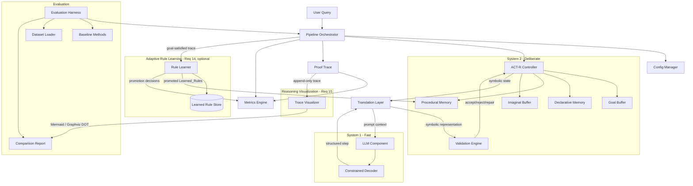
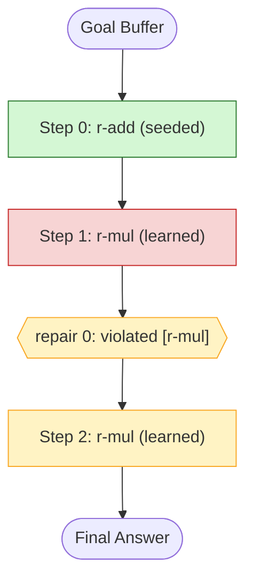

# Design Document

## Overview

The Neuro-Symbolic System-2 Reasoning Architecture is a hybrid inference system that
pairs a neural Large Language Model (LLM) acting as Kahneman's fast, associative
"System 1" with an ACT-R-style symbolic cognitive controller acting as the slow,
deliberate "System 2". Its defining characteristic is **step-level symbolic
validation inside a closed dual-process loop**: every intermediate reasoning step the
LLM produces is forced into a structured format, translated into a machine-checkable
symbolic representation, validated against symbolic production rules, and then
accepted, rejected, or repaired *before* it is allowed to influence the next step.

This contrasts with conventional approaches (Chain-of-Thought, Self-Consistency,
Tree-of-Thoughts, ReAct) that validate, vote on, or search over *complete* traces.
By correcting the neural generator mid-generation, the architecture aims to suppress
the propagation of hallucinated or logically invalid intermediate steps, which is the
dominant source of compounding error in multi-step reasoning.

The system is organized as a cyclic pipeline. Each cycle runs four stages in a fixed
order — LLM generation (constrained), translation to symbolic form, ACT-R controller
update, and validation/repair — under an ACT-R working-memory model (Goal,
Declarative, Procedural, Imaginal). Every action is journaled into a `Proof_Trace`
that yields both a machine-readable artifact and a human-readable rendering, and that
backs the system's quantitative metrics: the `Faithfulness_Score`, the
`Step_Level_Hallucination_Rate`, and `Reasoning_Consistency`. An evaluation harness
runs the system and four baselines across a six-domain step-level hallucination
benchmark and produces a comparative, reproducible report.

### Design Goals

- **Mid-generation correction**: validation and repair happen per step, not per trace.
- **Determinism and reproducibility**: a single seed governs all stochastic operations;
  conflict resolution is deterministic; runs persist a complete run record.
- **Interpretability**: every step, outcome, and applied rule is journaled and renderable.
- **Separation of concerns**: neural generation, symbolic state, translation, and
  validation are independent components communicating through well-defined contracts.
- **Measurable overhead**: System-2 latency is recorded separately from LLM latency so
  the accuracy/cost trade-off can be quantified against an LLM-only baseline.

### Key Design Decisions

| Decision | Rationale |
|---|---|
| One reasoning step per LLM call | Enables validation *before* the step propagates (Req 2.1, 6.1). |
| Constrained decoding to a structured schema | Guarantees every step is machine-parseable and translatable (Req 3). |
| Symbolic representation as a typed, logic-form record | Makes steps checkable by production rules and losslessly serializable (Req 5). |
| ACT-R four-buffer model | Provides a principled, inspectable working-memory state across steps (Req 4). |
| Deterministic conflict resolution policy | Required for reproducibility and consistency metrics (Req 4.6, 13.2). |
| Proof_Trace as the single source of truth | Drives metrics, interpretability, and error reporting uniformly (Req 7, 8, 11). |
| Pluggable LLM backend (hosted API or local) | Lets the same pipeline run under different runtimes via config (Req 2.3, 2.4). |
| Rule learning runs post-termination on goal-satisfied traces only | Keeps the per-step critical path unchanged and makes the disabled path identical to Req 1-13 (Req 14.1, 14.10). |
| Learned rules reuse the same IF/THEN string form as seeded rules | Promoted rules are evaluable by the unchanged ACTRController/ValidationEngine machinery (Req 14.3, 14.4). |
| Promotion gated by corroboration threshold + contradiction check | Preserves soundness: a learned rule never accepts a step an existing rule rejects (Req 14.3, 14.4). |
| Visualization is a pure function of the append-only Proof_Trace | No new state; rendering is lossless and reproducible (Req 15.1, 15.2). |

## Architecture

### High-Level Component View



The two new subsystems are additive: the **Rule Learner** (Req 14) consumes a
goal-satisfied `Proof_Trace` *after* termination and may feed promoted `Learned_Rules`
back into Procedural_Memory; the **Trace Visualizer** (Req 15) is a pure read-only
exporter over the existing append-only `Proof_Trace`. Neither sits on the per-step
critical path, so when rule learning is disabled the reasoning cycle is byte-for-byte
the behavior of Requirements 1-13 (Req 14.10).

### Dual-Process Reasoning Cycle

The orchestrator drives a bounded loop. Each cycle executes exactly four stages in
order (Req 1.2): generate → translate → controller update → validate. Repair is a
nested sub-loop triggered by rejection or by untranslatable/no-rule outcomes.

```mermaid
sequenceDiagram
    participant O as Orchestrator
    participant T as Translation Layer
    participant L as LLM (System 1)
    participant A as ACT-R Controller
    participant V as Validation Engine
    participant P as Proof Trace

    O->>A: initialize Goal_Buffer with query goal
    loop until goal satisfied OR cycle limit reached
        A->>T: symbolic state (goal, imaginal, declarative)
        T->>L: prompt context (back-translation)
        L->>L: constrained decode -> structured step
        L->>T: candidate Reasoning_Step
        T->>T: parse to Symbolic_Representation
        alt untranslatable
            T->>P: record untranslatable
            T->>O: route to repair
        else translated
            T->>A: symbolic representation
            A->>A: select production rule (deterministic)
            A->>V: candidate + applicable rules
            alt accepted
                V->>A: accept; store conclusion in Declarative_Memory
                A->>A: update Imaginal_Buffer, advance sub-goal
                V->>P: record accepted + applied rule
            else rejected
                V->>P: record rejected + violated rules
                O->>L: repair (regenerate constrained by violated rules)
            end
        end
    end
    O->>O: emit Verified_Output + Faithfulness_Score
```

### Termination Semantics

The reasoning cycle terminates for exactly one reason, recorded in the trace:

- `goal-satisfied` — active goal in Goal_Buffer satisfied (Req 1.3, emits Verified_Output).
- `cycle-limit-reached` — completed cycles reach the maximum cycle limit (Req 1.4).
- `constraint-unsatisfied` — constrained-decoding retries exhausted (Req 3.4).
- `repair-exhausted` — repair attempt limit reached without acceptance (Req 6.6).
- `component-error` — LLM unavailable, back-translation failure, or persistence failure
  (Req 1.6, 2.6, 5.5) returns an error record identifying the failed component.

### Technology Approach

The design is language-agnostic in specification, but the reference implementation
targets **Python** because the surrounding research ecosystem (LLM SDKs, dataset
tooling, ACT-R-style symbolic libraries, and numerical/metrics tooling) is strongest
there. Constrained decoding is realized through a grammar/JSON-schema-constrained
decoding library for local models and through structured-output / function-calling
modes for hosted APIs, selected by configuration. Property-based testing uses
**Hypothesis**.

## Components and Interfaces

### 1. Pipeline Orchestrator

Owns the reasoning cycle and enforces stage ordering, cycle bounds, and termination.

Responsibilities:
- Validate and accept a query, initialize the Goal_Buffer (Req 1.1, 1.7).
- Run cycles in the fixed four-stage order up to the cycle limit (Req 1.2, 1.4).
- Detect goal satisfaction and emit a `Verified_Output` (Req 1.3).
- Journal each step, outcome, and applied rule to the Proof_Trace (Req 1.5).
- Convert component failures into error records while preserving the trace (Req 1.6).

```python
class PipelineOrchestrator:
    def run(self, query: str) -> PipelineResult: ...
    # PipelineResult = VerifiedOutput | ErrorRecord, always carrying a ProofTrace
```

### 2. LLM Component (System 1)

Generates exactly one candidate reasoning step per request for the active sub-goal,
using the symbolic state context supplied by the Translation Layer (Req 2.1, 2.2).
Backend is selected by config — hosted API (endpoint + credentials from config, never
source) or local runtime (Req 2.3, 2.4). Enforces a generation timeout with bounded
retries; persistent failure yields an error record naming the LLM (Req 2.5, 2.6).

```python
class LLMComponent:
    def generate_step(self, context: PromptContext, constraint: OutputSchema)
        -> CandidateStep: ...   # raises LLMUnavailable / LLMTimeout after retries
```

### 3. Constrained Decoder

Restricts LLM output to the configured structured format before return (Req 3.1).
Non-conforming output is marked, journaled, and regenerated up to the retry count;
exhaustion terminates the query with `constraint-unsatisfied` (Req 3.3, 3.4). Active
constraints are derived from the current buffer contents (Req 3.5).

### 4. Translation Layer

Bidirectional bridge between neural text and symbolic state.
- Forward: structured step → `Symbolic_Representation` conforming to the
  machine-checkable encoding (Req 3.2, 5.1).
- Backward: Goal_Buffer + Imaginal_Buffer + Declarative_Memory → LLM prompt context
  (Req 5.2).
- Untranslatable forward step: flag, leave buffers unchanged, route to repair (Req 5.3).
- Failed back-translation: flag, journal, return error record naming the layer (Req 5.5).
- Records every translation outcome and direction in the trace (Req 5.4).

```python
class TranslationLayer:
    def to_symbolic(self, step: CandidateStep) -> SymbolicRepresentation | Untranslatable: ...
    def to_context(self, state: WorkingMemoryState) -> PromptContext: ...  # raises BackTranslationError
```

### 5. ACT-R Controller and Working-Memory Buffers (System 2)

Maintains the four buffers throughout a query (Req 4.1) and manages reasoning state:
- On acceptance: append the intermediate conclusion as a distinct Declarative_Memory
  entry, replace Imaginal_Buffer with a representation reflecting the accepted step
  (Req 4.2, 4.5), retain all prior conclusions until termination (Req 4.4).
- Sub-goal management: advance Goal_Buffer to the next unmet sub-goal, or mark the goal
  satisfied when none remain (Req 4.3, 4.7).
- Rule selection: when multiple rules match, select exactly one deterministically via
  the configured conflict-resolution policy (Req 4.6); when none match, record
  `no-rule-matched` and route to repair (Req 4.8).

```python
class ACTRController:
    def initialize(self, goal: Goal) -> None: ...
    def select_rule(self, state: WorkingMemoryState) -> ProductionRule | NoRuleMatched: ...
    def integrate_accepted(self, step: SymbolicRepresentation) -> None: ...
    def state(self) -> WorkingMemoryState: ...
```

### 6. Validation Engine

Evaluates a symbolic step against every applicable production rule and records an
accept/reject outcome before the next step is generated (Req 6.1). Accept requires all
applicable rules satisfied (Req 6.2); reject records every violated rule (Req 6.3).
Rejection triggers repair: regenerate constrained by the violated rules, incrementing
the repair count up to the limit (Req 6.4); repaired steps are re-validated against all
applicable rules (Req 6.5); exhaustion terminates with `repair-exhausted` (Req 6.6).
Every step and repair outcome is journaled (Req 6.7).

```python
class ValidationEngine:
    def validate(self, rep: SymbolicRepresentation, rules: list[ProductionRule])
        -> ValidationOutcome: ...   # accepted | rejected(violated_rules)
```

### 7. Repair Coordinator

Drives the nested repair sub-loop shared by rejection, untranslatable, and
no-rule-matched outcomes: build a repair prompt referencing the offending constraints,
request a regenerated step, re-translate and re-validate, and enforce the repair
attempt limit.

### 8. Metrics Engine

Computes from a terminated Proof_Trace: Faithfulness_Score (Req 7.1, 7.2),
Step_Level_Hallucination_Rate (Req 7.3), and, across repeated runs, Reasoning_Consistency
(Req 7.4, 7.5). Attaches the Faithfulness_Score to the Verified_Output (Req 7.6).

### 9. Proof Trace and Exporters

Append-only journal recording every step in execution order with sequence position,
outcome (accepted/rejected/repaired), and applied rule id or explicit
`no-rule-applied` (Req 8.1, 8.2). Repair attempts record rejected step, violated rule,
and resulting repaired step per attempt (Req 8.3). Exports a lossless machine-readable
form (Req 8.4) and a human-readable rendering (Req 8.5). Also records pipeline,
System-2, and LLM latencies and any latency-budget-exceeded flag (Req 11).

### 10. Evaluation Harness, Dataset Loader, Baselines

Runs the system and each configured baseline over the dataset (Req 9.1), computes
per-method metrics (Req 9.2), supports CoT/Self-Consistency/ToT/ReAct (Req 9.3),
produces a comparison report with per-metric differences (Req 9.4), computes latency
overhead against the LLM-only baseline (Req 9.5), and excludes failing items while
continuing (Req 9.7). The Dataset Loader validates items and domain labels, excludes
invalid items, and logs load statistics (Req 10).

### 11. Config Manager

Reads all runtime parameters at initialization, applies documented defaults for absent
values, and halts with a parameter-identifying error for out-of-range, disallowed-enum,
or unparseable values (Req 12).

### 12. Reproducibility Manager

Builds the run record, seeds all stochastic operations, generates a seed when none is
supplied, and persists the run record with metrics durably (Req 13).

### 13. Rule Learner (Adaptive Rule Learning)

The Rule Learner is an optional subsystem (gated by `rule_learning_enabled`, default
`false`) that induces new symbolic production rules from successful reasoning and
promotes the well-corroborated, non-contradicting ones into Procedural_Memory as
`Learned_Rules`. It runs **after** a query terminates with `goal-satisfied`, never on
the per-step critical path, so the disabled path is identical to Requirements 1-13
(Req 14.10).

It deliberately reuses the *exact* IF/THEN string machinery already used by the rest of
the system so that learned rules are first-class:
- Induction generalizes over the `condition`/`action` string form parsed by
  `ACTRController._condition_terms` and `ValidationEngine._clause_terms`.
- The contradiction check is expressed in terms of `ValidationEngine.validate`
  semantics, so a `Learned_Rule` is evaluated identically to a `Seeded_Rule`.

Responsibilities and flow:

1. **Induce** (Req 14.1, 14.2): on a goal-satisfied trace, generalize the accepted
   `ProofStep`s into `CandidateRule`s. Generalization replaces the concrete, instance
   specific tokens of an accepted step's representation with a conjunctive IF pattern
   over the step's stable predicate terms and a THEN pattern over the accepted
   conclusion's terms — the same term decomposition the controller and validator use,
   so the candidate is immediately evaluable by both. Each candidate records
   `RuleProvenance` (originating trace id and the accepted step ids).
2. **Corroborate** (Req 14.3): accumulate, in the `LearnedRuleStore`, how many
   *independent* successful traces have induced an equivalent candidate (equivalence is
   by normalized IF/THEN term sets, so two traces that produce the same generalization
   corroborate one candidate). Corroboration count is incremented at most once per
   distinct source trace id.
3. **Promote** (Req 14.3, 14.4, 14.9): promote a candidate to a `Learned_Rule` only when
   both hold:
   - its corroboration count `>= corroboration_threshold` (default 2); and
   - it does not contradict any existing rule (seeded or already-learned) in
     Procedural_Memory.

   The **contradiction check** is precise and reuses validation semantics: a candidate
   `c` contradicts an existing rule `r` iff there exists a step representation `s` such
   that `c` would *accept* `s` (treating `c` as the sole rule:
   `ValidationEngine.validate(s, [c]).accepted`) while `r` *rejects* `s`
   (`ValidationEngine.validate(s, [r]).rejected`). Operationally this is decided over
   the witness set of representations drawn from the candidate's own provenance steps
   plus the corroborating traces' accepted steps: if any witness is accepted by `c` but
   rejected by some existing `r`, the candidate is discarded (never promoted) and a
   discard log entry recording the candidate and the conflicting `rule_id` is appended
   to the run log (Req 14.4). When the number of promoted learned rules reaches
   `max_learned_rules`, promotion stops and a `cap-reached` entry is logged (Req 14.9).
4. **Record & persist** (Req 14.5, 14.6, 14.7): every accepted step's applied rule is
   marked learned-vs-seeded in the trace (see `ProofStep.applied_rule_origin` below);
   the resulting `Learned_Rule` set, the induction seed, the corroboration threshold,
   and each promotion decision are recorded in the `RunRecord`; and the versioned
   `LearnedRuleStore` (with provenance) is persisted durably via the
   `ReproducibilityManager`.

Determinism (ties Req 13): induction, candidate equivalence/ordering, corroboration, and
promotion are pure, ordering-stable functions of their inputs and the supplied seed. The
Rule Learner registers a seed hook with `ReproducibilityManager.register_seed_hook` so
any tie-breaking is governed by the single effective seed; candidates and promotions are
processed in a deterministic canonical order (by normalized IF/THEN key, then provenance
trace id), so the same inputs under the same seed always yield the same `LearnedRuleStore`
and the same promotion-decision sequence (Req 14.6).

```python
class RuleLearner:
    def __init__(
        self,
        store: "LearnedRuleStore",
        validation: ValidationEngine,
        *,
        corroboration_threshold: int = 2,
        max_learned_rules: int = 64,
        seed: Optional[int] = None,
    ) -> None: ...

    def induce(self, trace: ProofTrace, *, trace_id: str) -> list["CandidateRule"]:
        """Generalize the accepted steps of a goal-satisfied trace into candidates
        (Req 14.1, 14.2). Returns [] for a trace with no accepted steps or a
        non-goal-satisfied termination reason."""

    def corroborate(self, candidates: list["CandidateRule"]) -> None:
        """Merge candidates into the store, incrementing corroboration counts at most
        once per distinct source trace id (Req 14.3)."""

    def promote(
        self, procedural_memory: list[ProductionRule]
    ) -> "PromotionResult":
        """Promote corroborated, non-contradicting candidates up to max_learned_rules;
        discard contradicting candidates with a logged conflict; return the promoted
        Learned_Rules plus the decision log (Req 14.3, 14.4, 14.6, 14.9)."""

    def contradicts(
        self, candidate: "CandidateRule", existing: ProductionRule
    ) -> bool:
        """True iff some witness representation is accepted by `candidate` alone but
        rejected by `existing` alone, per ValidationEngine semantics (Req 14.4)."""
```

Orchestrator integration: the Rule Learner is invoked only on the `goal-satisfied`
termination path. When `rule_learning_enabled` is true, after
`_emit_verified_output` produces the `VerifiedOutput`, the orchestrator (or the
evaluation harness, which already owns the `ReproducibilityManager`) calls
`induce(trace) -> corroborate(...) -> promote(procedural_memory)` and, on promotion,
extends the controller's Procedural_Memory with the new `Learned_Rules` for subsequent
queries in the run. When `rule_learning_enabled` is false the entire block is skipped and
Procedural_Memory holds only `Seeded_Rules` (Req 14.10).

### 14. Trace Visualizer (Reasoning Visualization)

A pure, read-only exporter that renders an existing `Proof_Trace` as a machine-renderable
text diagram. It introduces no new state and reads only the append-only trace, so it is
lossless with respect to step order, validation outcomes, applied rule ids, and the
termination reason (Req 15.1, 15.2). It lives alongside `src/nsr/proof_trace_export.py`
and reuses `applied_rule_label` / `NO_RULE_APPLIED` for the no-rule indicator.

It emits **two** formats from the same traversal:
- **Mermaid** `flowchart TD` (`to_mermaid`).
- **Graphviz DOT** `digraph` (`to_dot`).

Both renderings show: `Goal Buffer -> Reasoning Step 1 -> Validation
(accepted/rejected/repaired) -> Repair branch (when present) -> ... -> Final Answer /
termination reason`. Each step node:
- is styled by outcome so accepted, rejected, and repaired steps are visually distinct
  (Mermaid `class` + `classDef`; DOT node `shape`/`fillcolor`) — Req 15.4;
- is annotated with its applied production rule id or the explicit `no-rule-applied`
  indicator, and, where a rule validated the step, a learned-vs-seeded marker derived
  from `ProofStep.applied_rule_origin` (ties Req 14.5) — Req 15.4;
- emits a branch node per `RepairAttempt`, ordered by `attempt_index` (Req 15.1).

The terminal node renders the `Verified_Output` (on `goal-satisfied`) or the
`termination_reason` value otherwise. An empty trace renders a well-formed minimal
diagram containing the goal/placeholder node and a single placeholder terminal rather
than failing (Req 15.5).

```python
def to_mermaid(trace: ProofTrace) -> str:
    """Render `trace` as a Mermaid flowchart (Req 15.1-15.5). Pure; never mutates
    `trace`. Distinct classDefs for accepted/rejected/repaired; node labels carry the
    applied rule id (or no-rule-applied) and a learned/seeded marker."""

def to_dot(trace: ProofTrace) -> str:
    """Render `trace` as a Graphviz DOT digraph with the same content and styling
    contract as `to_mermaid` (Req 15.3)."""

class RuleOrigin(str, Enum):
    SEEDED = "seeded"
    LEARNED = "learned"
```

The diagram styling mirrors the rest of the design's Mermaid usage:



### 15. Reproducibility Manager

Builds the run record, seeds all stochastic operations, generates a seed when none is
supplied, and persists the run record with metrics durably (Req 13). Also persists the
versioned `LearnedRuleStore` and records the rule-learning fields in the run record when
rule learning is enabled (Req 14.6, 14.7).

## Data Models

### Core Reasoning Types

```python
from dataclasses import dataclass, field
from enum import Enum
from typing import Optional

class ValidationStatus(str, Enum):
    ACCEPTED = "accepted"
    REJECTED = "rejected"
    REPAIRED = "repaired"

class TerminationReason(str, Enum):
    GOAL_SATISFIED = "goal-satisfied"
    CYCLE_LIMIT_REACHED = "cycle-limit-reached"
    CONSTRAINT_UNSATISFIED = "constraint-unsatisfied"
    REPAIR_EXHAUSTED = "repair-exhausted"
    COMPONENT_ERROR = "component-error"

@dataclass
class Goal:
    description: str
    sub_goals: list["SubGoal"]
    satisfied: bool = False

@dataclass
class SubGoal:
    description: str
    satisfied: bool = False

@dataclass
class SymbolicRepresentation:
    logic_form: str            # machine-checkable encoding
    predicates: dict           # structured fields parsed from the step
    source_text: str           # original LLM step text

@dataclass
class ProductionRule:
    rule_id: str
    condition: str             # IF pattern over working-memory state
    action: str                # THEN effect
```

### Working Memory

```python
@dataclass
class WorkingMemoryState:
    goal_buffer: Goal
    declarative_memory: list[SymbolicRepresentation]   # accepted conclusions, ordered
    procedural_memory: list[ProductionRule]
    imaginal_buffer: Optional[SymbolicRepresentation]  # current partial representation
```

### Proof Trace

```python
@dataclass
class RepairAttempt:
    attempt_index: int
    rejected_step: SymbolicRepresentation
    violated_rule_ids: list[str]
    repaired_step: Optional[SymbolicRepresentation]

@dataclass
class ProofStep:
    sequence: int
    step_text: str
    representation: Optional[SymbolicRepresentation]
    status: ValidationStatus
    applied_rule_id: Optional[str]          # None -> rendered as "no-rule-applied"
    violated_rule_ids: list[str] = field(default_factory=list)
    repair_attempts: list[RepairAttempt] = field(default_factory=list)
    translation_outcomes: list[dict] = field(default_factory=list)

@dataclass
class LatencyRecord:
    pipeline_ms: float
    system2_ms: float          # Validation_Engine + ACT-R Controller
    llm_ms: float
    latency_budget_exceeded: bool = False

@dataclass
class ProofTrace:
    steps: list[ProofStep]
    termination_reason: Optional[TerminationReason]
    latency: Optional[LatencyRecord]
    error_record: Optional["ErrorRecord"] = None

@dataclass
class ErrorRecord:
    failed_component: str
    reason: str

@dataclass
class VerifiedOutput:
    final_answer: str
    proof_trace: ProofTrace
    faithfulness_score: float
```

### Metrics

```python
@dataclass
class QueryMetrics:
    faithfulness_score: float            # accepted / total, 0.0 if empty trace
    step_hallucination_rate: float       # rejected / total
    reasoning_consistency: Optional[float]  # None when repeated-run count < 2

@dataclass
class MethodMetrics:
    method: str
    final_answer_accuracy: float
    step_hallucination_rate: float
    faithfulness_score: float
    latency_overhead_ms: float
    mean_latency_ms: float
    p95_latency_ms: float
    reasoning_consistency: Optional[float]
```

### Evaluation and Configuration

```python
class Domain(str, Enum):
    MATH = "mathematical-reasoning"
    COMMONSENSE = "commonsense-reasoning"
    MULTI_HOP = "multi-hop-reasoning"
    SCIENCE = "science-reasoning"
    LOGIC_PUZZLE = "logical-puzzles"
    LEGAL_QA = "legal-question-answering"

@dataclass
class DatasetItem:
    item_id: str
    query: str
    ground_truth: str
    domain: Domain

@dataclass
class SystemConfig:
    max_cycle_limit: int          # 1..10000
    repair_attempt_limit: int     # 0..1000
    retry_count: int              # 0..1000
    llm_selection: str            # enumerated allowed values
    output_format: str            # enumerated allowed values
    conflict_resolution_policy: str  # enumerated allowed values
    generation_timeout_ms: int
    repeated_run_count: int = 1
    latency_budget_ms: Optional[int] = None
    random_seed: Optional[int] = None

@dataclass
class RunRecord:
    config: SystemConfig
    dataset_ids: list[str]
    model_id: str
    seed: int                     # effective seed (supplied or generated)
    applied_defaults: dict
```

### Adaptive Rule Learning Types (Req 14)

These dataclasses are new and live in `nsr.models` (e.g. `models/learning.py`). They
reuse the existing `ProductionRule` IF/THEN string form so learned rules are evaluable
by the unchanged `ACTRController` and `ValidationEngine`.

```python
from dataclasses import dataclass, field
from enum import Enum
from typing import Optional

class RuleOrigin(str, Enum):
    """Marks whether an applied/stored rule was seeded or learned (Req 14.5)."""
    SEEDED = "seeded"
    LEARNED = "learned"

@dataclass
class RuleProvenance:
    """Where a Candidate_Rule came from (Req 14.2)."""
    trace_ids: list[str]                 # successful traces that induced/corroborated it
    step_ids: list[int]                  # accepted ProofStep.sequence values it generalizes
    induction_seed: Optional[int] = None # effective seed under which it was induced

@dataclass
class CandidateRule:
    """An induced, not-yet-promoted generalization of accepted reasoning steps."""
    rule: ProductionRule                 # IF/THEN in the same form as seeded rules
    provenance: RuleProvenance
    corroboration_count: int = 1         # distinct successful traces corroborating it
    normalized_key: str = ""             # canonical IF/THEN term-set key for equivalence

@dataclass
class LearnedRule:
    """A promoted Candidate_Rule now active in Procedural_Memory (Req 14.3)."""
    rule: ProductionRule
    provenance: RuleProvenance
    origin: RuleOrigin = RuleOrigin.LEARNED

@dataclass
class DiscardedCandidate:
    """A candidate discarded for contradicting an existing rule (Req 14.4)."""
    candidate: CandidateRule
    conflicting_rule_id: str

@dataclass
class PromotionDecision:
    """One recorded promote/discard/cap-reached decision (Req 14.6)."""
    normalized_key: str
    promoted: bool
    reason: str                          # "corroborated", "below-threshold",
                                         # "contradiction", "cap-reached"
    conflicting_rule_id: Optional[str] = None

@dataclass
class PromotionResult:
    """Outcome of a promotion pass over the store (Req 14.3, 14.4, 14.9)."""
    promoted: list[LearnedRule] = field(default_factory=list)
    discarded: list[DiscardedCandidate] = field(default_factory=list)
    decisions: list[PromotionDecision] = field(default_factory=list)
    cap_reached: bool = False

@dataclass
class LearnedRuleStore:
    """Versioned, JSON-persistable store of candidates and promoted learned rules.

    Persisted durably (with provenance) via ReproducibilityManager (Req 14.7). A
    store_to_dict/store_from_dict pair round-trips losslessly, including the version
    identifier, mirroring proof_trace_export.
    """
    version: int = 1
    candidates: dict[str, CandidateRule] = field(default_factory=dict)  # key -> candidate
    learned_rules: list[LearnedRule] = field(default_factory=list)
```

**Backward-compatible `ProofStep` extension (Req 14.5).** Rather than rewrite the
existing `ProofStep`, add one optional field with a default so all existing traces and
the existing `trace_to_dict`/`trace_from_dict` round-trip continue to work unchanged:

```python
# extension to nsr.models.trace.ProofStep
applied_rule_origin: Optional[RuleOrigin] = None
#   None        -> unknown / no rule applied (renders as today)
#   SEEDED      -> applied rule was a Seeded_Rule
#   LEARNED     -> applied rule was a Learned_Rule
```

`proof_trace_export._step_to_dict` / `_step_from_dict` gain an
`"applied_rule_origin"` key (serialized as the enum `value`, omitted/`None`-tolerant on
read) so the learned-vs-seeded marker survives the machine-readable round-trip while
older artifacts without the key still parse.

**Backward-compatible `SystemConfig` extension (Req 14.8).** Three new fields are added
with defaults, so existing configs remain valid:

```python
# extension to nsr.models.config.SystemConfig
rule_learning_enabled: bool = False      # Req 14.8 default: disabled
corroboration_threshold: int = 2         # Req 14.8 default: 2; range 1..1000
max_learned_rules: int = 64              # Req 14.8 documented cap; range 1..100000
```

Wired into `config_manager.py`: add `rule_learning_enabled` (parsed as bool, default
`False`), `corroboration_threshold` (`CORROBORATION_THRESHOLD_RANGE = (1, 1000)`,
default `2`), and `max_learned_rules` (`MAX_LEARNED_RULES_RANGE = (1, 100000)`, default
`64`) to `DEFAULTS`, resolving and range-checking them exactly as the existing numeric
parameters do, and recording each applied default in `applied_defaults` (Req 14.8).

**`RunRecord` extension (Req 14.6).** Add optional, default-empty fields so existing run
records remain valid:

```python
# extension to nsr.models.config.RunRecord
learned_rules: list[LearnedRule] = field(default_factory=list)
induction_seed: Optional[int] = None
corroboration_threshold: Optional[int] = None
promotion_decisions: list[PromotionDecision] = field(default_factory=list)
```

### Reasoning Visualization Types (Req 15)

The visualizer adds no data model state; it is a pure function over `ProofTrace`. The
only shared type is `RuleOrigin` (above), used to render the learned-vs-seeded marker.
Node styling is expressed as a small internal mapping from `ValidationStatus` to a style
class/shape, not as persisted state:

```python
# internal to the visualizer module (no new persisted state)
_STATUS_CLASS = {
    ValidationStatus.ACCEPTED: "accepted",
    ValidationStatus.REJECTED: "rejected",
    ValidationStatus.REPAIRED: "repaired",
}
```

## Correctness Properties

*A property is a characteristic or behavior that should hold true across all valid
executions of a system-essentially, a formal statement about what the system should do.
Properties serve as the bridge between human-readable specifications and
machine-verifiable correctness guarantees.*

The properties below extend the existing test suite to cover Requirements 14 and 15.
Both subsystems are pure, deterministic, input-sensitive logic over generated traces and
rule sets, which makes them well suited to property-based testing.

### Property 1: Induction generalizes only accepted steps

*For any* goal-satisfied `Proof_Trace`, every `CandidateRule` produced by
`RuleLearner.induce` is generalized solely from accepted (or accepted-after-repair)
`ProofStep`s of that trace; induction over a trace with no accepted steps, or a trace
whose termination reason is not `goal-satisfied`, yields the empty list.

**Validates: Requirements 14.1**

### Property 2: Candidates are provenance-traceable

*For any* `CandidateRule` produced by induction, its `RuleProvenance` has a non-empty
`trace_ids` and `step_ids`, and every referenced step id corresponds to an accepted step
present in the source trace.

**Validates: Requirements 14.2**

### Property 3: Promotion requires corroboration and no contradiction

*For any* candidate corroborated across `k` independent successful traces under threshold
`t`, with an existing rule set `R`, the candidate is promoted to a `Learned_Rule` if and
only if `k >= t` and it does not contradict any rule in `R`.

**Validates: Requirements 14.3**

### Property 4: Contradicting candidates are discarded and logged

*For any* candidate `c` and existing rule `r` such that some witness representation is
accepted by `c` alone but rejected by `r` alone (per `ValidationEngine.validate`), `c` is
never promoted and a discard record naming `r`'s `rule_id` is produced.

**Validates: Requirements 14.4**

### Property 5: Learned-vs-seeded marker is preserved across trace round-trip

*For any* `Proof_Trace` whose accepted steps carry an `applied_rule_origin`, the marker is
present for every accepted step and `trace_from_dict(trace_to_dict(trace))` preserves the
learned-vs-seeded marker of every step.

**Validates: Requirements 14.5**

### Property 6: Rule learning is deterministic under a fixed seed

*For any* fixed inputs (traces, existing rules, threshold, cap) and fixed seed, running
induce -> corroborate -> promote twice yields equal `LearnedRuleStore` contents and an
identical sequence of `PromotionDecision`s, and the recorded run-record fields
(`learned_rules`, `induction_seed`, `corroboration_threshold`, `promotion_decisions`) are
equal across the two runs.

**Validates: Requirements 14.6**

### Property 7: Learned rule store serialization round-trips losslessly

*For any* `LearnedRuleStore`, `store_from_dict(store_to_dict(store)) == store`, preserving
the version identifier, all candidates, corroboration counts, learned/seeded markers, and
every provenance field.

**Validates: Requirements 14.7**

### Property 8: Config applies documented rule-learning defaults

*For any* configuration mapping that omits `rule_learning_enabled`,
`corroboration_threshold`, or `max_learned_rules`, the loaded config takes the documented
defaults (`false`, `2`, and the documented cap) and records each applied default in
`applied_defaults`; *for any* out-of-range `corroboration_threshold` or
`max_learned_rules`, loading halts with a parameter-identifying error.

**Validates: Requirements 14.8**

### Property 9: Promoted learned rules never exceed the cap

*For any* set of promotable, non-contradicting candidates and any `max_learned_rules`
cap `m`, the number of `Learned_Rules` promoted in a pass is at most `m`, and whenever the
candidate set would exceed `m` a `cap-reached` decision is recorded.

**Validates: Requirements 14.9**

### Property 10: Disabled rule learning is behaviorally identical to Req 1-13

*For any* query and seeded rule set, processing with `rule_learning_enabled = false`
produces a `VerifiedOutput`/`ProofTrace` (final answer, step sequence, outcomes, applied
rule ids, termination reason) equal to the baseline pipeline with no rule-learning path,
and Procedural_Memory contains only `Seeded_Rules`.

**Validates: Requirements 14.10**

### Property 11: Visualization is structurally complete

*For any* `Proof_Trace`, the emitted diagram (Mermaid and DOT) contains exactly one step
node per `ProofStep` plus a goal node and a terminal node, one branch node per
`RepairAttempt`, an edge from each step to its successor, and a terminal node reflecting
the `Verified_Output` or the `termination_reason`.

**Validates: Requirements 15.1**

### Property 12: Visualization is a lossless pure function of the trace

*For any* `Proof_Trace`, `to_mermaid` and `to_dot` do not mutate the trace, and the
emitted text contains every step's sequence position, its validation outcome, its applied
rule id (or the explicit `no-rule-applied` indicator), and the termination reason string.

**Validates: Requirements 15.2**

### Property 13: Nodes are outcome-distinguished and rule-annotated

*For any* `Proof_Trace`, each step node carries the style class/shape corresponding to its
`ValidationStatus` (accepted, rejected, repaired are mutually distinct), and each node
label contains the applied rule id or the `no-rule-applied` indicator and, where a rule
validated the step, the learned-vs-seeded marker.

**Validates: Requirements 15.4**

## Error Handling

Additions for Requirements 14 and 15:

- **Rule learning is best-effort and never corrupts a successful query.** Induction,
  corroboration, and promotion run after `goal-satisfied` termination; any failure within
  the Rule Learner is caught, logged to the run log, and leaves the already-emitted
  `VerifiedOutput` and Procedural_Memory unchanged (the query result still stands).
- **Contradiction is a normal outcome, not an error**: contradicting candidates are
  discarded with a logged `conflicting_rule_id` (Req 14.4); the cap-reached condition is
  logged, not raised (Req 14.9).
- **Learned-rule-store persistence failures** reuse the existing `ReproducibilityManager`
  contract: a failed write returns an `ErrorRecord` naming the failed persistence
  operation rather than raising, so the run is not reported successful (consistent with
  Req 13.5).
- **Config errors** for the new parameters raise the existing `ConfigError`, identifying
  the offending parameter (Req 14.8), exactly as other numeric/enum parameters do.
- **Visualization never fails on shape**: an empty trace renders a well-formed minimal
  placeholder diagram instead of raising (Req 15.5); unknown/`None` `applied_rule_origin`
  renders without a learned/seeded marker rather than erroring.

## Testing Strategy

Additions for Requirements 14 and 15:

**Dual approach.** Property-based tests (via **Hypothesis**, minimum 100 iterations each)
cover the universal properties above; example/edge tests cover concrete scenarios.

Property tests (one property-based test per property, tagged
**Feature: neuro-symbolic-reasoning-agent, Property {number}: {property_text}**):
- Properties 1-10 exercise the Rule Learner and its config/run-record/round-trip
  guarantees, generating random goal-satisfied traces, rule sets, thresholds, and caps.
  Property 10 (Req 14.10) is a model-based equivalence test against the unchanged Req 1-13
  pipeline. Property 4's (Req 14.4) witness generation reuses `ValidationEngine.validate` so the
  contradiction semantics under test match production semantics exactly.
- Properties 11, 12, 13 generate random traces (mixed accepted/rejected/repaired
  steps, repair attempts, every termination reason, and the learned/seeded marker) and
  assert structural completeness, losslessness, and outcome-distinguished annotation by
  parsing the emitted Mermaid/DOT text.

Example and edge tests (not property-based):
- **Req 15.3 (EXAMPLE):** assert `to_mermaid` output begins with a `flowchart` header and
  `to_dot` output is a `digraph { ... }`, on a small representative trace.
- **Req 15.5 (EDGE_CASE):** assert both exporters return a well-formed minimal diagram for
  an empty `ProofTrace` without raising.
- **Req 14.7 durable-write (EXAMPLE/integration):** assert the versioned store is written
  to disk and reloads equal, and that a write failure yields an `ErrorRecord`.
- **Req 14.8 (EXAMPLE):** assert the specific documented default values
  (`false`, `2`, `64`) are applied when keys are absent.

Property test configuration mirrors the existing suite: each property-based test runs a
minimum of 100 generated examples and references its design property in the test tag.
