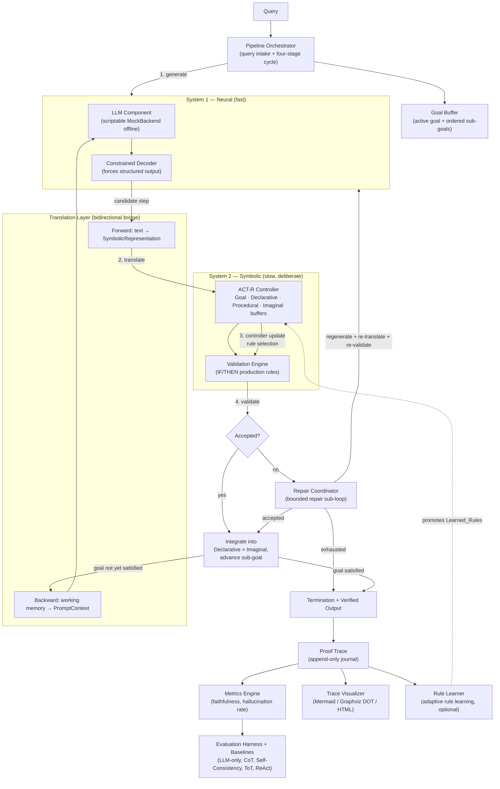

# Neuro-Symbolic System-2 Reasoning Architecture

This document describes the runtime architecture of the `nsr` system as exercised by
the demo package. The system pairs a neural **System 1** (a Large Language Model) with a
deliberate, symbolic **System 2** (an ACT-R-style cognitive controller plus a rule-based
validation engine). Every intermediate reasoning step is translated into a
machine-checkable symbolic form, validated against production rules, and **accepted,
rejected, or repaired before it can influence the next step**. The result is a verifiable
*Proof Trace* and a *Faithfulness Score* alongside the final answer.

## Dual-process pipeline

## Components

**Pipeline Orchestrator** (`nsr.orchestrator.PipelineOrchestrator`) — Owns query intake
and the bounded reasoning cycle. It validates and parses the query into a `Goal` with
ordered sub-goals, initializes the Goal Buffer *before any step is generated*, then drives
the four-stage cycle until the goal is satisfied or a termination condition is reached. It
journals every step into the Proof Trace and converts component failures into error
records without discarding the trace.

**LLM Component (System 1)** (`nsr.llm_component`) — Generates exactly one candidate
reasoning step per request from a pluggable backend. The demo uses `MockBackend`, a
scripted, in-memory backend that returns deterministic completions with **no network and
no API key**. Swapping in a hosted-API or local-runtime backend is purely a configuration
change.

**Constrained Decoder (System 1)** (`nsr.constrained_decoder`) — Forces each completion
into the configured structured format (here, JSON carrying a `logic_form`) and derives
active decoding constraints from the current buffer contents. Non-conforming output is
journalled and regenerated up to the retry count.

**Translation Layer** (`nsr.translation_layer`) — The bidirectional bridge between the two
systems. *Forward* translation converts a structured candidate step into a
machine-checkable `SymbolicRepresentation`; *backward* translation renders the working
memory back into a prompt context for the next generation. Untranslatable steps are routed
to repair.

**ACT-R Controller (System 2)** (`nsr.actr_controller`) — Maintains the four working-memory
buffers for the lifetime of a query: the **Goal Buffer** (active goal and sub-goals), the
**Declarative Memory** (accepted intermediate conclusions, in order), the **Procedural
Memory** (IF/THEN production rules), and the **Imaginal Buffer** (the partial problem
representation under construction). It selects exactly one production rule deterministically
via the configured conflict-resolution policy and integrates accepted steps.

**Validation Engine (System 2)** (`nsr.validation_engine`) — Evaluates each step's symbolic
representation against every applicable production rule. A step is accepted only when every
applicable rule is satisfied; otherwise it is rejected and *every* violated rule is recorded.

**Repair Coordinator** (`nsr.repair_coordinator`) — Drives a bounded repair sub-loop for the
three repair-triggering outcomes (validation rejection, untranslatable step, no rule
matched). Each attempt builds a repair prompt that references the offending constraints,
regenerates, re-translates, and re-validates, recording every attempt in the Proof Trace.

**Proof Trace + Exporters** (`nsr.proof_trace`, `nsr.proof_trace_export`) — The append-only
journal of every step in execution order, its outcome, applied rule, repair attempts,
latency, and termination reason. Exporters produce a lossless machine-readable form and a
human-readable rendering.

**Trace Visualizer** (`nsr.trace_visualizer`) — Pure exporters that render a trace as a
Mermaid flowchart or a Graphviz DOT digraph, styling steps by outcome and annotating each
with its applied rule and learned/seeded marker.

**Metrics Engine** (`nsr.metrics_engine`) — Computes the Faithfulness Score (accepted /
total steps), the Step-Level Hallucination Rate (rejected / total steps), and
Reasoning Consistency across repeated runs.

**Rule Learner (Adaptive Rule Learning)** (`nsr.rule_learner`) — Optional, off the
per-step critical path. After a goal-satisfied run it induces candidate production rules
from the accepted steps, corroborates them across traces, and promotes the
well-supported, non-contradicting ones into Procedural Memory as *Learned Rules*. Applied
learned rules are marked distinctly from seeded rules in the trace and visualization.

**Evaluation Harness + Baselines** (`nsr.evaluation_harness`, `nsr.baselines`,
`nsr.comparison_report`) — Runs the System and a set of baseline reasoning methods
(LLM-only, Chain-of-Thought, Self-Consistency, Tree-of-Thoughts, ReAct) over a dataset,
aggregates per-method metrics, and builds a comparison report.

## The four-stage cycle (with the repair sub-loop)

Each cycle runs four stages **in this fixed order**:

1. **Generate** — Backward translation renders the working memory into a prompt; the
   Constrained Decoder asks System 1 for exactly one structured candidate step.
2. **Translate** — Forward translation converts the candidate into a
   `SymbolicRepresentation`. An untranslatable step is routed to repair.
3. **Controller update** — The ACT-R Controller selects exactly one applicable production
   rule for the current state (or signals *no rule matched*, routing to repair).
4. **Validate** — The Validation Engine checks the representation against every applicable
   rule.

If validation **accepts** the step, it is integrated into Declarative Memory, the Imaginal
Buffer is updated, and the Goal Buffer advances to the next unmet sub-goal — or the goal is
marked satisfied. If validation **rejects** the step (or the step was untranslatable / had
no matching rule), the **Repair Coordinator** runs a bounded sub-loop: build a repair
prompt referencing the offending constraints → regenerate → re-translate → re-validate,
recording each attempt. A repaired-then-accepted step is marked `REPAIRED` in the trace; an
exhausted repair budget terminates the query with `repair-exhausted`.

The cycle terminates for exactly one reason: `goal-satisfied`, `cycle-limit-reached`,
`constraint-unsatisfied`, `repair-exhausted`, or `component-error`. On `goal-satisfied` the
orchestrator emits a `VerifiedOutput` carrying the final answer, the Proof Trace, and the
Faithfulness Score.
